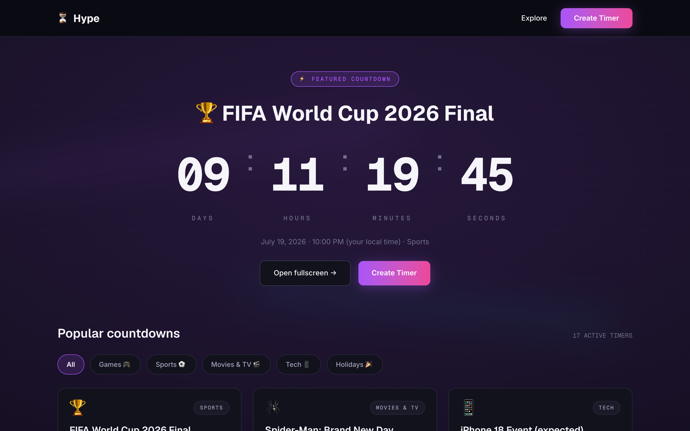
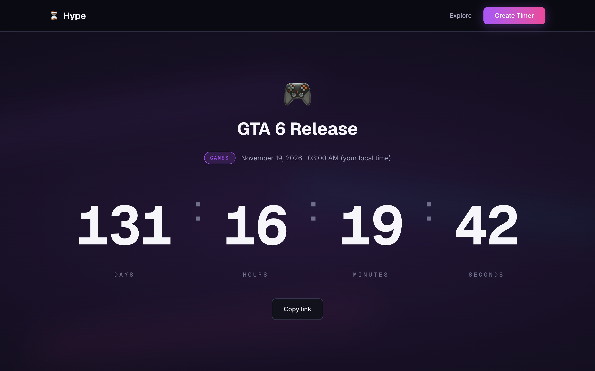
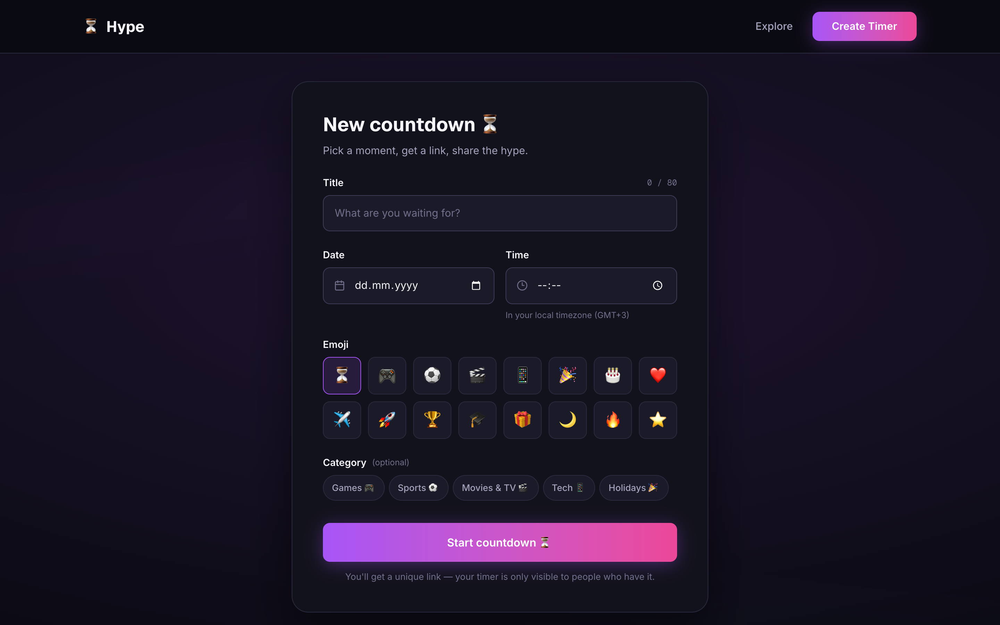
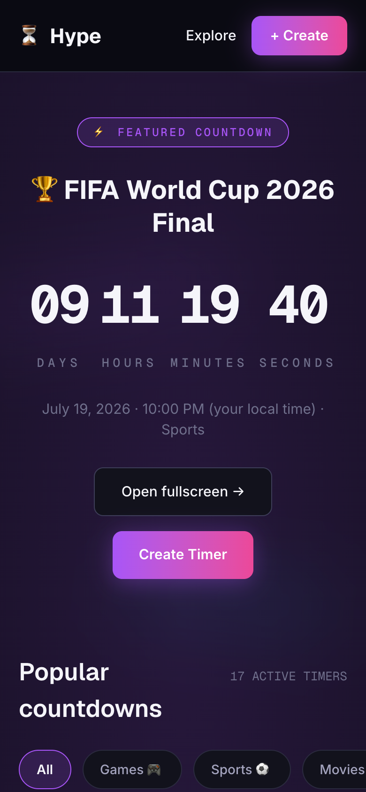

# Hype ⏳

**Countdown to what's next.** A premium-looking countdown site for the moments everyone is waiting for — game releases, finals, premieres, holidays — plus custom timers you can create and share with a single link. No accounts, no setup.


## Demo

| Explore | Timer detail | Create |
|---|---|---|
|  |  |  |

<details>
<summary>Mobile (390px)</summary>



</details>

## Features

- **Curated countdowns** — 17 hand-picked timers for popular events (GTA 6, FIFA World Cup 2026 Final, iPhone 18 Event…), filterable by category: Games, Sports, Movies & TV, Tech, Holidays.
- **Custom timers** — pick a moment, get a unique link (`/t/:slug`), share the hype. Custom timers are visible only to people who have the link; they never appear in Explore.
- **Actually correct countdowns** — the client syncs to the server clock (`serverNow` offset), so timers stay accurate even when the visitor's system clock is hours off.
- **Ended state** — when the moment arrives, the timer flips live to “🎉 It's time!”.
- **Dark premium UI** — near-black canvas, glow gradients, and a giant animated counter ([NumberFlow](https://number-flow.barvian.me/) digit transitions), designed screen-by-screen before implementation.
- **Local timezones** — dates are stored in UTC and rendered in each visitor's locale and timezone.

## Tech stack

| Layer | Stack |
|---|---|
| Frontend | React + Vite (JavaScript), Tailwind CSS v4, [motion](https://motion.dev), `@number-flow/react`, react-router |
| Backend | Node.js + Express, SQLite (better-sqlite3), per-IP rate limiting |
| Design | [Pencil](https://pencil.dev) (`ugc_design.pen`) — dark premium design system, Skiper UI aesthetic |
| Testing | Node test runner (31 backend tests), headless-Chrome e2e smoke (19 checks) |

## Getting started

Requires Node.js 20+.

```bash
# 1. Backend (API on :3001, SQLite auto-created and seeded with 17 curated timers)
cd backend
npm install
npm start

# 2. Frontend (Vite dev server on :5173, proxies /api to :3001)
cd frontend
npm install
npm run dev
```

Open http://localhost:5173.

**Configuration** (all optional): `PORT` and `DB_PATH` for the backend; `TRUST_PROXY` when running behind a reverse proxy (`true` = 1 hop, or a hop count); `API_PROXY_TARGET` to point the Vite dev proxy at a non-default backend.

### Tests

```bash
cd backend && npm test          # 31/31 — contract, validation, rate limit, seed, migrations

cd frontend && node e2e/smoke.mjs   # 19 end-to-end checks (needs both servers; see file header)
```

## API

Three endpoints, documented in [`docs/api.md`](docs/api.md):

- `GET /api/timers?category=` — curated, non-expired timers
- `GET /api/timers/:slug` — one timer (curated or custom)
- `POST /api/timers` — create a custom timer (rate-limited: 20/hour per IP)

Every response includes `serverNow` for client clock correction.

## How it was built 🤖

This project was built end to end by an **agentic AI team** (Claude Code): a Product Manager orchestrator delegating to specialist subagents — UI designer (Pencil), frontend and backend developers, a QA engineer, and a code reviewer. The team runs a self-correction loop: every agent self-reviews before finishing, writes a retro, and recurring mistakes become permanent rules in the agents' definition files.

The full paper trail is in the repo:

- [`docs/PRD.md`](docs/PRD.md) — product requirements (v2.1)
- [`docs/copy.md`](docs/copy.md) — UI copy deck (single source of truth for strings)
- [`docs/qa-report.md`](docs/qa-report.md) — release QA report (10/10 acceptance criteria)
- [`.claude/agents/`](.claude/agents/) — the team's agent definitions, including their accumulated “Lessons Learned”
- [`.claude/retros/`](.claude/retros/) — per-task retrospectives

## License

MIT
